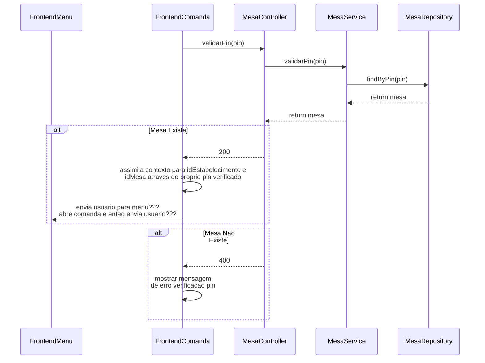

```mermaid
sequenceDiagram
    %% this is a comment
    participant FrontendMenu
    participant FrontendComanda    
    participant MesaController
    participant MesaService
    participant MesaRepository

    FrontendComanda->>MesaController: validarPin(pin)

    MesaController->>MesaService: validarPin(pin)

    MesaService->>MesaRepository: findByPin(pin)
    
    MesaRepository-->>MesaService: return mesa

    MesaService-->>MesaController: return mesa

    alt Mesa Existe
        MesaController-->>FrontendComanda: 200
        FrontendComanda->>FrontendComanda: assimila contexto para idEstabelecimento e<br> idMesa atraves do proprio pin verificado
        FrontendComanda->>FrontendMenu: envia usuario para menu???<br>abre comanda e entao envia usuario???
    end

    alt Mesa Nao Existe
        MesaController-->>FrontendComanda: 400
        FrontendComanda->>FrontendComanda: mostrar mensagem<br> de erro verificacao pin
    end
    


```