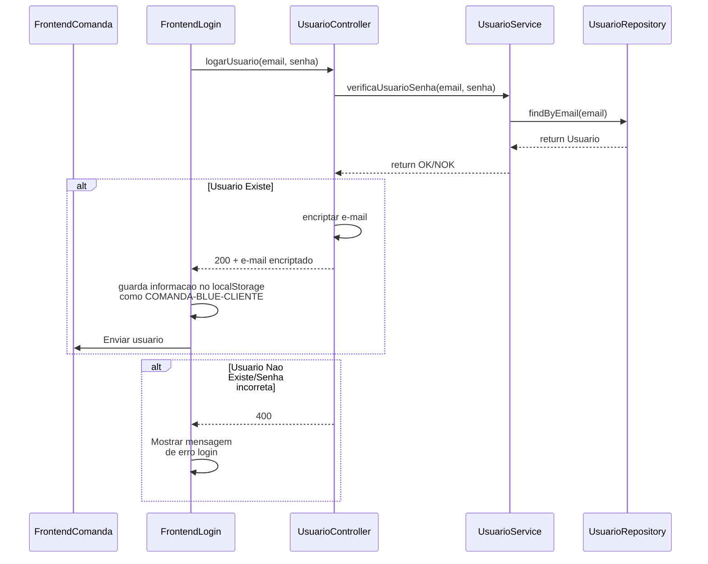

```mermaid
sequenceDiagram
    participant FrontendComanda
    participant FrontendLogin
    participant UsuarioController
    participant UsuarioService
    participant UsuarioRepository

    FrontendLogin->>UsuarioController: logarUsuario(email, senha)
    UsuarioController->>UsuarioService:  verificaUsuarioSenha(email, senha)
    UsuarioService->>UsuarioRepository: findByEmail(email)
    UsuarioRepository-->>UsuarioService: return Usuario    
    UsuarioService-->>UsuarioController: return OK/NOK
    alt Usuario Existe
        UsuarioController->>UsuarioController: encriptar e-mail
        UsuarioController-->>FrontendLogin: 200 + e-mail encriptado
        FrontendLogin->>FrontendLogin: guarda informacao no localStorage<br> como COMANDA-BLUE-CLIENTE
        FrontendLogin->>FrontendComanda: Enviar usuario
    end
    alt Usuario Nao Existe/Senha incorreta
        UsuarioController-->>FrontendLogin: 400
        FrontendLogin->>FrontendLogin: Mostrar mensagem<br> de erro login
    end
```