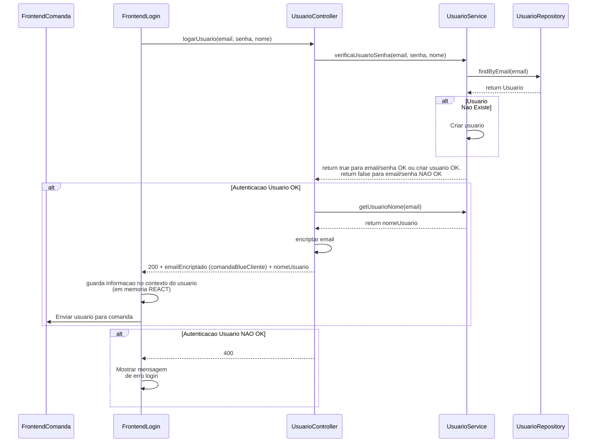

```mermaid
sequenceDiagram
    %% this is a comment
    participant FrontendComanda
    participant FrontendLogin
    participant UsuarioController
    participant UsuarioService
    participant UsuarioRepository

    FrontendLogin->>UsuarioController: logarUsuario(email, senha, nome)

    UsuarioController->>UsuarioService:  verificaUsuarioSenha(email, senha, nome)

    UsuarioService->>UsuarioRepository: findByEmail(email)    

    UsuarioRepository-->>UsuarioService: return Usuario    
    alt Usuario Nao Existe
        UsuarioService->>UsuarioService: Criar usuario
    end

    UsuarioService-->>UsuarioController: return true para email/senha OK ou criar usuario OK.<br> return false para email/senha NAO OK

    alt Autenticacao Usuario OK
        UsuarioController->>UsuarioService:  getUsuarioNome(email)
        UsuarioService-->>UsuarioController: return nomeUsuario
        UsuarioController->>UsuarioController: encriptar email
        UsuarioController-->>FrontendLogin: 200 + emailEncriptado (comandaBlueCliente) + nomeUsuario
        FrontendLogin->>FrontendLogin: guarda informacao no contexto do usuario<br>(em memoria REACT)
        FrontendLogin->>FrontendComanda: Enviar usuario para comanda
    end

    alt Autenticacao Usuario NAO OK
        UsuarioController-->>FrontendLogin: 400
        FrontendLogin->>FrontendLogin: Mostrar mensagem<br> de erro login
    end
```